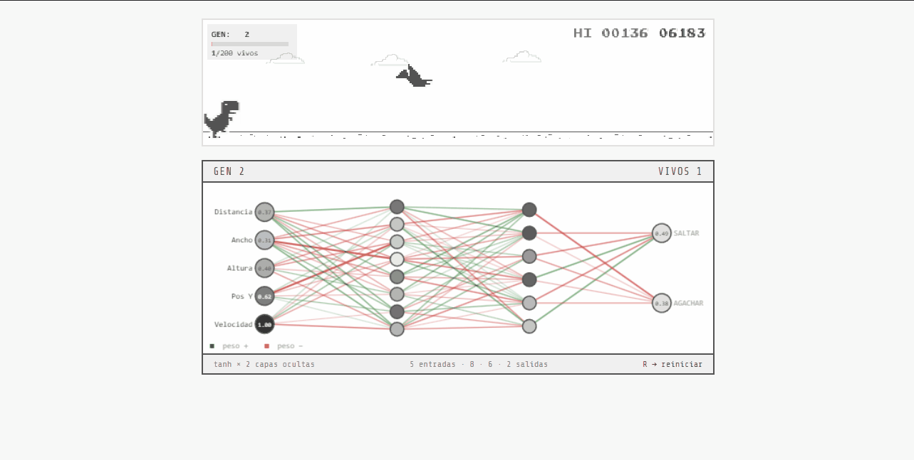

# AI Arcade Lab

Bienvenido a AI Arcade Lab, un laboratorio de experimentación dedicado a aplicar Inteligencia Artificial y Aprendizaje por Refuerzo (Reinforcement Learning) en videojuegos clásicos y de estrategia.

Este repositorio es un "monorepo" que agrupa varios proyectos, cada uno explorando diferentes algoritmos y arquitecturas de IA.

---

## Visión General de los Proyectos

### 1. [Neural Pong Evolution](./pong-rl/)
Proyecto que utiliza Aprendizaje por Refuerzo para dominar el clásico juego de Pong mediante una arquitectura cliente-servidor híbrida.
- Frontend: TypeScript, HTML5 Canvas, Vite.
- Backend / IA: Python, FastAPI, WebSockets, Stable-Baselines3 (PPO), Gymnasium.
- [Ver documentación completa](./pong-rl/README.md) | [Manual Técnico Específico](./pong-rl/manual.md)

### 2. [Soldaditos RTS](./soldaditoss/)
Juego de estrategia en tiempo real (RTS) 2D donde dos equipos de agentes PPO se enfrentan en combate directo.
- Enfoque: Entrenamiento "Self-Play" donde los agentes mejoran jugando entre ellos.
- Tecnologías: Pygame, Stable-Baselines3 (PPO), entorno personalizado de Gymnasium.
- [Ver documentación completa](./soldaditoss/README.md)

### 3. T-Rex Runner & AI
El clásico juego del dinosaurio de Chrome, modernizado y ampliado para ser jugado de forma autónoma.
- [T-Rex Runner](./t-rex-runner/): El juego clásico portado a un código limpio con Vite + TypeScript.
- [T-Rex AI](./t-rex-ai/): Extensión del juego base donde los agentes aprenden a sortear los obstáculos usando algoritmos genéticos y redes neuronales.
- [Ver documentación (T-Rex AI)](./t-rex-ai/README.md) | [Ver documentación (T-Rex Runner)](./t-rex-runner/README.md)

---

## Manual Técnico Completo
Para obtener información detallada sobre la arquitectura global, el proceso de entrenamiento de cada agente, y los orígenes históricos de cada integración (incluyendo orígenes del T-Rex), consulte el [Manual Técnico del Laboratorio](./manual.md).

## Requisitos Generales

Cada proyecto es independiente y cuenta con sus propias instrucciones de configuración, pero a nivel general necesitará:

- Node.js y npm: Para los frontends y proyectos en TypeScript (pong-rl, t-rex-runner, t-rex-ai).
- Python 3.8+: Para entrenar y ejecutar los agentes de IA en el backend (pong-rl, soldaditoss).

Consulte el archivo README.md respectivo en cada subdirectorio para instrucciones detalladas.

## Créditos y Licencias

- Desarrollado y mantenido por Aldair Andrade.
- Las licencias de las adaptaciones de juegos de código abierto (como el T-Rex Runner de Chromium) se encuentran detalladas dentro de cada subproyecto.
